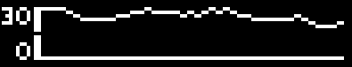
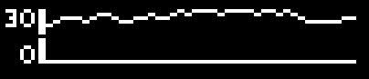
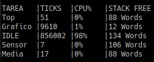

# Sistemas operativos 2-Trabajo practico 7
## Informe
### Descripcion
El objetivo del trabajo era trabajar sobre un RTOS, y generar un conjunto de tareas que atravez de un scheduler y unas prioridades asignadas hagan las cosas descriptas en la consigna
1. Una tarea que simule un sensor de temperatura. Generando valores aleatorios, con una frecuencia de 10 Hz.
2. Una tarea que reciba los valores del sensor y aplique un filtro pasa bajos.
Donde cada valor resultante es el promedio de las ultimas N mediciones.
3. Una tarea que grafica en el display los valores de temperatura en el tiempo.
4. Se debe poder recibir comandos por la interfaz UART para cambiar el N
del filtro.
5. Calcular el stack necesario para cada task. Realizar el análisis utilizando
**uxTaskGetStackHighWaterMark** o **vApplicationStackOverflowHook**.
6. Implementar una tarea tipo top de linux, que muestre periódicamente
estadı́sticas de las tareas (uso de cpu, uso de memoria, etc).

Partiendo de la demo visto en la clase arranque a estudiar los elementos presentes en el mismo, viendo que podiamos usar, a la par de leer la documentacion brindada por [FreeRTOS](https://www.freertos.org/a00106.html)   

### Sensor 
Esta tarea consistia en generar un valor de temperatura y mandarlo a la siguiente tarea, para simular esto partimos de un valor dado, y segun un numero aleatorio lo aumentamos o disminuiamos asegurandonos de pasar de 30 o menos que 0. La lib std de ```rand()``` no funcionaba asi que usamos una implementacion extraida de otra de demo de FreeRTOS.
```c
uint32_t ulRandom( void )
{
  _dwRandNext = _dwRandNext * 1103515245 + 12345 ;

  return (uint32_t)(_dwRandNext/131072) % 65536 ;
}
```
Esta funciona y genera cierta variabilidad que es lo que necesitabasmos. 

### Generador de Promedios
Esta funcion recibe el valor generado por **Sensor** y genera un *Shift L* con un arreglo y el valor obtenido
```c
static void vPushArreglo(int arreglo[], int valor,int tam_arreglo)
{
  for(int i=0; i < tam_arreglo-1; i++)
    arreglo[i] = arreglo[i+1];

  arreglo[tam_arreglo-1] = valor;
}
```
Posteriormente genera un promedio de los ultimos **N** elementos del arreglo.
```c
static int dCalcularPromedio(int arreglo[],int ventana,int tam_arreglo)
{
  int promedio=0;
  if (ventana > tam_arreglo)
    while (1) {}

  for (int i = 0; i < ventana; i++) 
    promedio += arreglo[(tam_arreglo-1)-i];

  return promedio/ventana;
}
```

Esto lo manda al graficador.
### Graficador 
Esta fue la que mas dolor de cabeza genero pero una vez que se entendio como funcionaba dio rienda suelta al *artista interior*.
Resulta ser que cada columna tiene 1 bit de ancho y 8 de alto, el display tiene 96 columnas de largos, ademas de un segundo renglon con estas mismas dimensiones.
Entonces debo usar un caracter para graficar la columna en su codificacion **UTF-8**, para esto use un traductor de [binario a UTF-8](https://onlineutf8tools.com/convert-binary-to-utf8).
Esto lo describo con tranquilidad pero me tomo bastante tiempo darme cuenta como se hace.

Entonces, una vez recibido el valor del promedio generado, este se guarda en un arreglo de 84 espacios que es numero de columnas a graficar, usando la misma funcion de **Shift L** vista antes.
Graficamos los ejes y en un *for* graficamos los elementos en el arreglo, traduciendolos a un caracter con un codigo binario correspondiente a un 1 en el lugar en la columna que corresponda.
```c
static char* sObtenerCaracter(int valor)
{
  if(valor < 2)
    return "@";
  else if(valor < 4)
    return "`";
  else if( valor < 8)
    return "P";
  else if( valor < 10)
    return "H";
  else if(valor < 12)
    return "D";
  else if(valor < 14)
    return "B";
  else if( valor < 16)
    return "A";
  else if(valor <18)
    return "@";
  else if(valor <20)
    return " ";
  else if(valor <22)
    return "";
  else if(valor <24)
    return "";
  else if (valor <26)
    return "";
  else if(valor <28)
    return "";
  else if(valor <=30)
    return "";
}
```
Y ademas a el renglon que corresponda.
```c
static int dObtenerFila(int valor)
{
  if(valor > 16)
    return 0;

  return 1;
}
```


### Ingreso UART
Con la configuracion que trae la demo basto para dejarlo andando, fue cuestion de agregar un check periodico de si hay algun caracter ingresado que modifique el valor de N.
```c 
int dObtenerN(unsigned short int N)
{
  if(UARTCharsAvail(UART0_BASE))
  {
    char caracter
      ,N_nuevo[3];
    int i=0
      ,nuevo_N=0;

    while((caracter =(char)UARTCharNonBlockingGet(UART0_BASE)) != -1)
    {
      N_nuevo[i] = caracter;
      if(i==2) break;
      i++;
    }
    N_nuevo[i] = '\0';
    nuevo_N = atoi(N_nuevo);
    if( atoi(N_nuevo) > 1 && atoi(N_nuevo) < 10 )
      N = atoi(N_nuevo);
  }
  return N;
}
```
Como se ve, el valor de n se limita entre 1 y 10, ya que para simplificar la lectura, leo solamente un valor.
Podemos usar gdb para ver cuando un valor si ingresa o mas graficamente ver las graficas con cada uno.

Por defecto arranca en N = 10 :


Y si ingresamos N=2 :



Ambas son la misma grafica, con la misma seed. Pero podemos ver que el promedio se vuelve mas volatil por el hecho de usar menos muestras.

### Stack
Hubo un momento en el cual el grafico no estaba mostrando informacion y resulto se un tema de stack, me di cuenta porque aumente el limite minimo y arranco a funcionar, he de admitir que no es la forma mas profesional. De todas formas, implemente un corta fuegos utilizando *uxTaskGetStackHighWaterMark*, que quedaba en un loop. Tengo entendido que *vApplicationStackOverflowHook*, cumple mejor con esta funcion, pero de esta forma identificaba cual era la funcion que daba problemas, siendo este un dato inutil, a decir verdad.

### Top
Este me hizo renegar un poco. Intente usar la implementacion brindada por la [API de FreeRTOS](https://www.freertos.org/rtos-run-time-stats.html), pero esta daba errores en el linkeo ya que usaba librerias std. Asi que fui a la implementacion y la adapte, cambiando los ```sprintf()``` por una implementacion propia que recibe strings y los manda por UART
```c 
void vMandarStringUART(const char *mensaje)
{
  while(*mensaje != '\0')
  {
    UARTCharPut(UART0_BASE,*mensaje);
    mensaje++;
  }
  UARTCharPut(UART0_BASE,'\0');
  return;
}
```
El otro problema es que hay que brindarle a la API acceso a la lectura de un timer para llevar un conteon del uso de tiempo de cpu.
Esta ultima fue problematica, pero termine optando por configurar la interrupcion de el *timer0* para que cada cierto tiempo aumente una variable global, ha decir verdad, carece de calculo, es mas que nada funcional, y de hecho lo hace.
De esa forma, use la estructura dada por la *API* y trabajando los strings obtengo la siguiente salida por el **serial0**.



Los resultados me parecen los esperables, teniendo tiempo de cpu alto en funciones graficadoras que son las que mas tareas acumulan y un tiempo de IDLE bastante alto.
